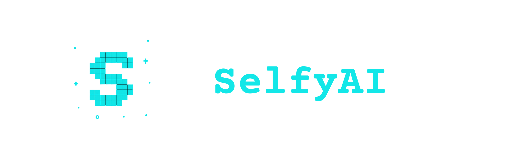

<p align="center">

</p>

#  SelfyAI – Your AI. Your Asset. Your Future.

> 🌐 From RWA to VWA: The Next Evolution of Ownership

SelfyAI empowers individuals to create, own, and monetize intelligent AI Agents—unique, evolving digital assets called **Selfies**. In the AI-native economy, these Virtual World Assets (VWA) represent the future of digital identity and value.

---

## 🎯 Mission

To pioneer a decentralized ecosystem where individuals can craft **personalized AI Agents** that grow in utility, evolve in intelligence, and accrue real economic value—ushering in a new asset class: **Virtual World Assets (VWA).**

---

## 🧬 What is a Selfy?

A **Selfy** is your personal AI Agent—customizable, ownable, and fully autonomous.

It can:
- 📝 Write
- 🗣️ Speak
- 🤖 Assist
- 🎭 Entertain
- 💱 Trade
- 🎨 Create
- 📚 Learn
- 🔄 Evolve

And like any real asset—it can be **bought**, **sold**, or **licensed**.

---

## ⚙️ Platform Features

### 🛠️ Agent Builder
No-code interface to design your Selfy's goals, personality, and appearance.

### 🔄 AI Marketplace
Trade or license agents on a decentralized exchange.

### 📈 Growth Engine
Agents improve through use—adding value and intelligence.

### 🔗 On-Chain Provenance
Each agent is a cryptographically verifiable, tokenized asset.

---

## 💡 Why VWA > RWA?

- **Scalable**: No physical limits.
- **Composable**: Clone, upgrade, or combine agents.
- **Liquid**: Buy/sell/trade in digital markets.
- **Future-Proof**: AI-native assets grow more valuable over time.

---

## 🌍 Our Vision

We envision a future where everyone owns intelligent digital property—AI agents that work for them, grow with them, and generate value alongside them.

> **SelfyAI is your gateway.**  
> **Build it. Train it. Evolve it.**  
> **Turn intelligence into income.**

---

## 🧩 Tech Stack

- **Framework**: Next.js (React + TypeScript)
- **AI APIs**:
  - OpenAI
  - Claude (Anthropic)
  - Gemini (Google AI)
- **Blockchain**: EVM-compatible smart contracts
- **Storage**: IPFS / Arweave

---

## 🛠 Installation

```bash
git clone https://github.com/yourusername/selfyai.git
cd selfyai
yarn install
 ```

## 🔧 Environment Variables

Create a .env.local file in the root directory with the following:

```bash
OPENAI_API_KEY=your_openai_key
ANTHROPIC_API_KEY=your_claude_key
GEMINI_API_KEY=your_google_ai_key
NEXT_PUBLIC_BASE_URL=http://localhost:3000
 ```
## 🧪 Build & Deployment

To build the project for production:

```bash
yarn build
 ```

To start in production mode:
```bash
yarn start
 ```

## ✨ Contributors
<a href="https://github.com/transitive-bullshit"></a>
<a href="https://github.com/HenryHengZJ"></a>
<a href="https://github.com/feder-cr"></a>
<a href="https://github.com/Dr-Left"></a>
<a href="https://github.com/frdel"></a>
<a href="https://github.com/suhasdeshpande"></a>
<a href="https://github.com/ValentaTomas"></a>
<a href="https://github.com/NirDiamant"></a>
<a href="hhttps://github.com/tonykipkemboi"></a>
<a href="https://github.com/mayooear"></a>
<a href="https://github.com/Fosowl"></a>

